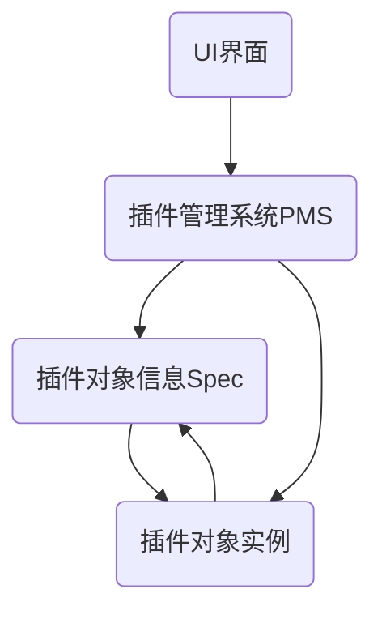
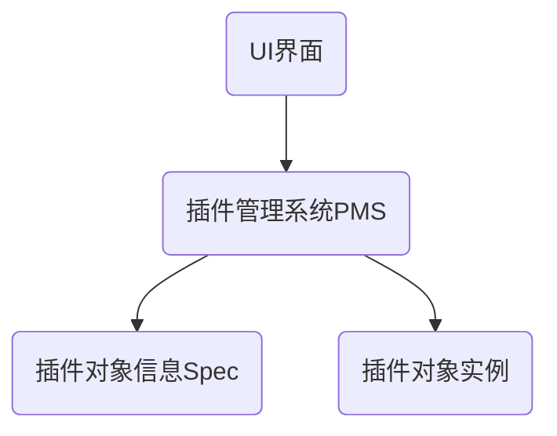
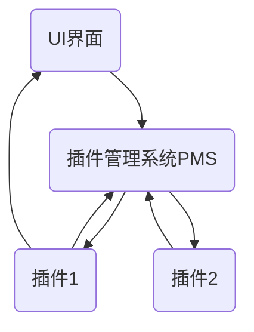

# Frame

Frame是一套通用的上位机程序，包含UI界面，插件管理系统(Plug-in management system, PMS)，插件信息Spec ，插件模板IPlugin四个模块。

## 模块间的访问关系

插件加载后的四个模块之间的访问关系如下：

插件卸载后的四个模块之间的访问关系如下：

## 插件对象实例的通信方式
+ UI界面与只能通过插件管理系统转发的方式向插件对象实例发送信息
+ 插件对象之间只能通过插件管理系统转发的方式发送信息
+ 插件可以直接向UI界面发送消息

